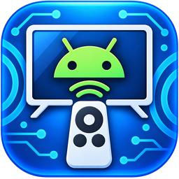

# ioBroker.androidtvremote

Unofficial Android TV / Google TV remote control adapter for ioBroker using the Android TV Remote v2 protocol.

The adapter maintains a persistent connection to an Android TV or Google TV device and provides remote control, power state, volume information, currently active application and optional Google Cast media metadata.

## Features

- Android TV Remote v2 protocol
- No ADB or wireless debugging required
- Secure pairing with Android TV / Google TV
- Pairing certificate stored locally after initial pairing
- Persistent Remote v2 connection
- Automatic reconnect after connection loss
- Power state
- Volume and mute state
- Currently active Android application
- Friendly names for many common streaming apps
- Unknown application package detection
- Remote key commands
- Text input
- App/deep-link launching
- Power control
- Manual reconnect
- Pairing reset
- Optional Google Cast session and media metadata

## Requirements

- ioBroker
- Node.js 22 or newer
- Android TV or Google TV device supporting the Android TV Remote v2 protocol
- ioBroker host and Android TV / Google TV device must be reachable over the network

Default Android TV Remote v2 ports:

| Function | Port |
|----------|------|
| Remote | 6466 |
| Pairing | 6467 |

## Installation

Install the adapter in ioBroker and create an instance.

Enter the IP address or hostname of the Android TV / Google TV device in the adapter configuration.

## Pairing

On the first connection, the Android TV / Google TV device displays a pairing code.

Enter this code into:

    androidtvremote.0.control.pairingCode

After successful pairing, the certificate is stored locally by the adapter and normally no further pairing is required.

To remove the stored pairing information and pair again, trigger:

    androidtvremote.0.control.forgetPairing

## Configuration

| Setting | Description | Default |
|---------|-------------|---------|
| IP address / hostname | Android TV / Google TV device | |
| Pairing name | Name shown on the TV during pairing | ioBroker |
| Pairing port | Android TV Remote v2 pairing port | 6467 |
| Remote port | Android TV Remote v2 remote-control port | 6466 |
| Reconnect interval | Delay before reconnecting after a failed connection | 15 s |
| Protocol debug | Enable additional protocol logging | disabled |
| Cast media information | Enable optional Google Cast monitoring | enabled |
| Cast polling interval | Interval for checking Cast media information | 5 s |

## Datapoints

### Information

    info.connection
    info.pairingRequired
    info.powered
    info.currentAppId
    info.currentApp
    info.currentAppUnknown
    info.volume.level
    info.volume.maximum
    info.volume.muted

`info.currentAppId` contains the original Android package name.

`info.currentApp` provides a human-readable application name for many common applications, including Netflix, YouTube, Prime Video, ARD, ZDF, RTL+, MagentaTV, Joyn, Zattoo, waipu.tv, DAZN, Spotify, KiKA, WOW, Disney+ and Apple TV.

Unknown package names are additionally written to `info.currentAppUnknown` so that the application mapping can easily be extended.

### Controls

    control.pairingCode
    control.key
    control.text
    control.appLink
    control.power
    control.reconnect
    control.forgetPairing

### Google Cast

When Cast monitoring is enabled:

    info.cast.connection
    info.cast.appId
    info.cast.appName
    info.media.title
    info.media.subtitle
    info.media.playerState
    info.media.contentId

## Media metadata

Android TV Remote v2 itself provides information about the currently active Android application, but does not expose complete media metadata for every native Android TV application.

The optional Cast integration can provide title, subtitle and playback state when an active Google Cast receiver session exposes this information.

Therefore, media metadata may not be available for applications that are running natively on the Android TV device.

## Connection handling

The adapter keeps the Android TV Remote v2 connection open instead of periodically disconnecting and rebuilding it.

Protocol ping requests are handled by the underlying Remote v2 library.

If the initial connection fails or an established connection is lost, the adapter retries the connection using the configured reconnect interval.

## Changelog

<!--
    Placeholder for the next version (at the beginning of the line):
    ### **WORK IN PROGRESS**
-->

### 0.2.7 (2026-10-09)

- Added automated GitHub Actions release workflow
- Prepared npm publishing through Trusted Publishing
- Updated release documentation and changelog
- No changes to adapter runtime behavior

[Older changelog entries](CHANGELOG_OLD.md)

## License

MIT License

Copyright (c) 2026 Henrik Schönhofen <henrik.schoenhofen@icloud.com>

See [LICENSE](LICENSE) for the full license text.
